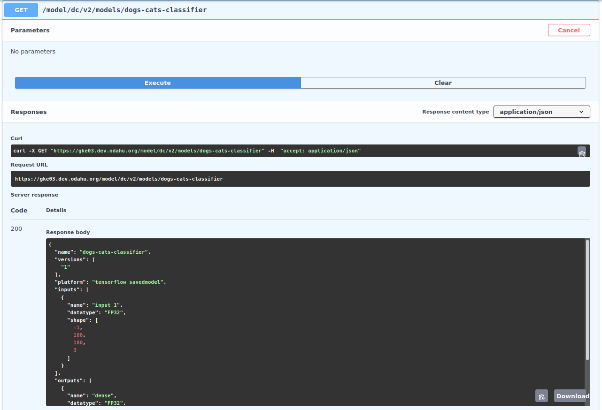
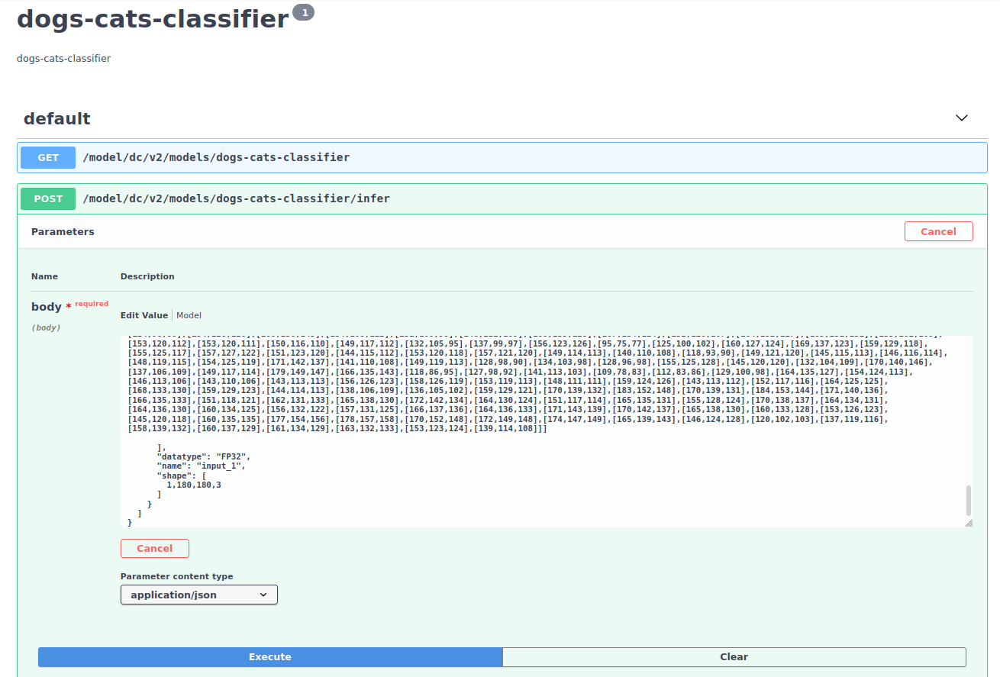
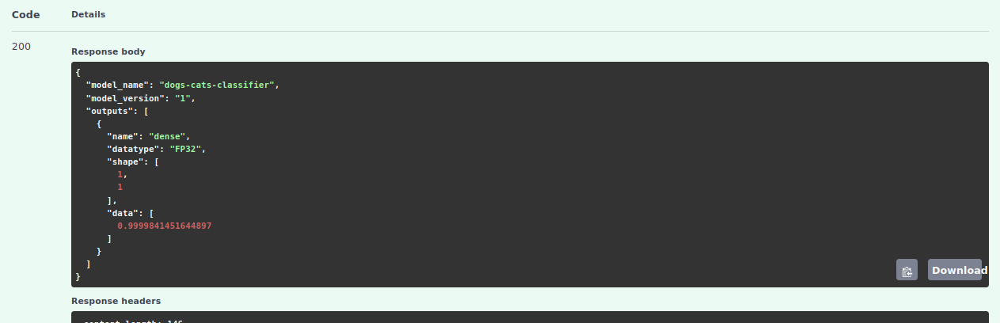

# Dogs/Cats Image Classifier
This example demonstrates an automated pipeline that trains a model on 
GPU, bundles NVIDIA Triton Inference Server with the trained model into
a Docker image and deploy the image on ODAHU deployment platform.

Developed and tested on ODAHU cluster deployed in GCP.

The model in this example classifies images into 2 classes: Dogs and Cats.

Model training mirrors this Keras tutorial: https://keras.io/examples/vision/image_classification_from_scratch/

## Pre-requisites
1. ODAHU cluster deployed in GCP
1. Available GPU node pools for training and deployment

## Quickstart
The pipeline is built as an Airflow DAG ([dag.py](dag/dag.py)). To deploy the DAG copy it
to the `dags` directory in data bucket of your cluster. Usually data bucket is the same
as the one referred by `models-output` Connection.
```shell
DATA_BUCKET=my-cluster-data-store
gsutil cp dag/dag.py gs://$DATA_BUCKET_URI/dags/dogs_cats_dag.py
```
Once Airflow performs an automatic DAG discovery, the DAG will appear in Airflow UI.

Trigger the DAG with the following configuration. 
```json
{
  "data_bucket": "PUT_DATA_BUCKET_HERE"
}
```
It must be the same bucket as specified in `models-output` Connection.

## DAG Steps
1. Put training data to data bucket so that ODAHU is able to use it for training.<br> 
   _Note: Perhaps in the real world the data flow that forms training dataset is a separate responsibility 
   and would not be a part of this DAG. For sake of simplicity this DAG automatically prepares 
   training data by itself._
   
1. Submit `ModelTraining` to ODAHU and wait for it to complete. Model Training requests Nvidia GPU. With 50 epochs and
   GPU training takes about 90 minutes. To reduce that time (and accuracy) you can set smaller number of epochs 
   in Training specification. <br>
   `ModelTraining` uses `mlflow-project` Toolchain, which means that input file structure must be an MLFlow Project
   and output file structure is arbitrary and is formed by user in `train.py`. In this example we save trained Keras
   model in TensorFlow SavedModel format.
   
1. Submit `ModelPackaging` to ODAHU and wait for completion. `docker-triton` Packaging Integration is used. It takes
   the result artifact of completed training and bundles it with NVIDIA Triton Inference Server into ready-to-deploy 
   Docker Image.
   
1. Submit `ModelDeployment` and wait for a container to start.  

## Test Classification

An image for classification must be represented as a 3-dimensional tensor of shape: `[180, 180, 3]`. 180px width, 
180px height, and 3 values for RBG. Example pre-processing logic before classification:

```python
import numpy as np
from PIL import Image

image_path = '/path/to/image.jpg'

with Image.open(image_path) as image:
    image_tensor = np.array(image.resize([180, 180]))

print(image_tensor)
```

Triton Server implements KFServing Predict Protocol Version 2. Visit 
[this page](https://github.com/kubeflow/kfserving/blob/master/docs/predict-api/v2/required_api.md)
to learn more about available HTTP endpoints for inference or metadata. 

### Classification request via UI

Visit the **PLAY** tab of `ModelDeployment`. Make a GET request to a model to get a list of expected inputs.



JSON response with model metadata:

```json
{
  "name": "dogs-cats-classifier",
  "versions": ["1"],
  "platform": "tensorflow_savedmodel",
  "inputs": [{
    "name": "input_1",
    "datatype": "FP32",
    "shape": [-1, 180, 180, 3]
  }],
  "outputs": [{
    "name": "dense",
    "datatype": "FP32",
    "shape": [-1, 1]
  }]
}
```
Notice the definition of inputs expected by the model. Now we will use it to build an inference request JSON. 
Most of the data is omitted in this snippet to keep it small.

```json
{
   "inputs": [{
      "name": "input_1",
      "datatype": "FP32",
      "shape": [1, 180, 180, 3],
      "data": [
         [[[42,40,52],[33,32,39],[20,19,18],[37,34,31],
            ...
            <much more data omitted here>
            ...
            [163,132,133],[153,123,124],[139,114,108]]]
      ]
   }]
}
```

Make an inference request to deployed model to get the result of classification.
Inference Request:

Inference Response:


Response JSON:
```json
{
  "model_name": "dogs-cats-classifier",
  "model_version": "1",
  "outputs": [
    {
      "name": "dense",
      "datatype": "FP32",
      "shape": [1, 1],
      "data": [0.9999841451644897]
    }
  ]
}
```

The model returned the probability that input image is a picture of a dog. In above example it is 99%.
